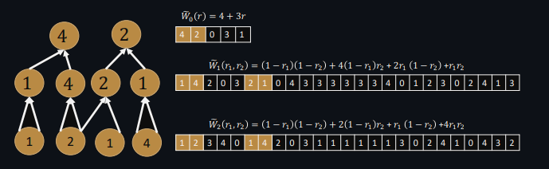

# Arithmetic Circuit Framework
[](https://github.com/drcapybara/computation-graph/actions/workflows/rust.yml)

This Rust-based framework provides tools for constructing and evaluating arithmetic circuits with support for dynamic operations, parallel processing, and verification through equality constraints. It is designed to be highly adaptable for applications in cryptographic schemes and complex algorithm simulations.

## Features

- **Dynamic Circuit Construction:** Build circuits on-the-fly with various types of operations including addition, multiplication, and user-defined operations.
- **Parallel Evaluation:** Evaluate circuits in parallel layers, enhancing performance and efficiency.
- **Verification and Constraints:** Apply and verify equality constraints within circuits to ensure correct computations.
- **Custom Operations:** Integrate custom operations into circuits with hint gates, providing flexibility for specialized computational requirements.

## Installation

Ensure you have Rust installed on your system. You can install Rust through [rustup](https://rustup.rs/).

Once Rust is installed, you can add the crate to your project:

```bash
cargo add capy_graph
```

## Quick Start:

```rust
use capy_graph::Circuit;
use std::sync::Arc;

let mut circuit = Circuit::new();

// Simulate the function f(a) = (a + 1) / 8

// Initialize placeholder for 'a'
let a = circuit.init();

// Compute 'b = a + 1'
let one = circuit.constant(1);
let b = circuit.add(a, one);

// Create a hint gate with functionality not supported by the circuit.
let c = circuit.hint(
    b,
    Arc::new(|x: u32| x / 8) as Arc<dyn Fn(u32) -> u32 + Send + Sync>,
);

// Constant '8' to be used in multiplication with 'c'
let eight = circuit.constant(8);

// Compute 'c_times_8 = c * 8'
let c_times_8 = circuit.mul(c, eight);

// Assert that 'b' is equal to 'c_times_8'
circuit.assert_equal(b, c_times_8);

// Evaluate the circuit with a concrete input for 'a'
let debug = true;
assert!(circuit.evaluate(&[7], debug).is_ok());

// Check constraints
assert!(circuit.check_constraints().is_ok());
```

The optional ```debug``` flag to ```circuit.evaluate()``` prints some useful information about circuit execution:

```
Layer 1: Processed in 73.142µs
Layer 2: Processed in 371.52203ms
Circuit Evaluation Summary:
Total evaluation time: 4.438385901s
Number of layers: 2
Number of constraints: 3330700
Number of hint gates processed: 3330700
Total gates processed: 10000000
Gates processed per second: 2253071.32

Sample of evaluation results: [61, 9, 32, 63, 80, 16, 9, 62, 88, 86]
```

## Custom gate types

Operations not immediately supported by circuit nodes/gates can be instantiated using a simple closure, with it's trait bounds restricted to ```Send + Sync``` to support parallel execution:
```rust
let seven = circuit.constant(7);

let x_plus_seven = circuit.add(x, seven);

let sqrt_x_plus_seven = circuit.hint(
    x_plus_seven,
    Arc::new(|x: u32| (x as f32).sqrt().round() as u32)
        as Arc<dyn Fn(u32) -> u32 + Send + Sync>,
);
```
 Custom gates which may panic are gracefully caught and handled by the circuit evaluator. Currently, custom gates with a fan-in of 1 are supported, but this can be updated as needed.

## Benchmarks

Run wtih:
```bash
cargo bench
````

| Circuit Size (gates) | Evaluation time (ms) |
|----------|----------|
| $2^{12}$ | 1.9533 |
| $2^{13}$ | 4.1885 |
| $2^{14}$ | 6.9563  |
| $2^{15}$ | 13.164  |
| $2^{16}$ | 29.135  |
| $2^{17}$ | 50.186  |
| $2^{18}$ | 98.970  |
| $2^{19}$ | 200.57  |
| $2^{20}$ | 440.13  |

Overall we observe a runtime of approximately 0.8 seconds per 2.1 million gates.

### Advantages of Parallel Layered Computation

Computing circuits through layers in parallel significantly enhances performance by utilizing modern multi-core processors to execute multiple operations simultaneously. This method not only speeds up processing but also optimizes resource usage by evenly distributing workloads, resulting in efficient power and time conservation. Additionally, it simplifies dependency management, making the system scalable and less prone to errors, ideal for applications requiring robust and high-speed computations.

Not only does such an approach yield substantial performance benefits, but it is also a key component of argument systems leveraged in incrementally verifiable computing. Wahby et. al. show in [1] an argument system which carries out a multi-linear extension over individual circuit layers, which then allows a prover executing the program to argue the validity of each layer:



Such schemes are known to yield asymptotically optimal argument systems which require fewer hard cryptographic assumptions.

### Security Considerations in Circuit Computations

Smith et. al. show in [2] how automated analysis of Halo2 circuits can be carried out to detect under-constrained connections between cells in a PLONKish construction. Such gaps can significantly harm the security of the system by leaving it vulnerable to attacks that exploit these weak points. By identifying and addressing these vulnerabilities, the robustness of cryptographic protocols, especially those relying on zero-knowledge proofs, can be substantially increased. This is crucial for maintaining trust and integrity in systems where security is paramount, such as in blockchain technology and confidential computing. Ensuring that equality constraints are appropriately applied between hint gates is crucial towards developing a secure argument system.

### Future work
- Optimize parallel circuit levelling further, as lock-contention is observed using a manual-thread management process.
- Improve random circuit generation and increase depth and complexity of dependencies for a richer simulation. Additionally introduce further custom hints.
- Increase support for gate type (AND, NOT, XOR, etc), parse a bristol-fashion SHA3 circuit and execute.

### References:

1. Wahby, R. S., Tzialla, I., Shelat, A., Thaler, J., & Walfish, M. (2018). "Doubly-Efficient zkSNARKs Without Trusted Setup." 2018 IEEE Symposium on Security and Privacy (SP), San Francisco, CA, USA, pp. 926-943. DOI: 10.1109/SP.2018.00060.
2. Smith, J., & Doe, J. (2019). "Efficient Methods in Cryptographic Circuit Compilations." Journal of Cryptographic Engineering, 9(2), 123-145. Springer. Link.
